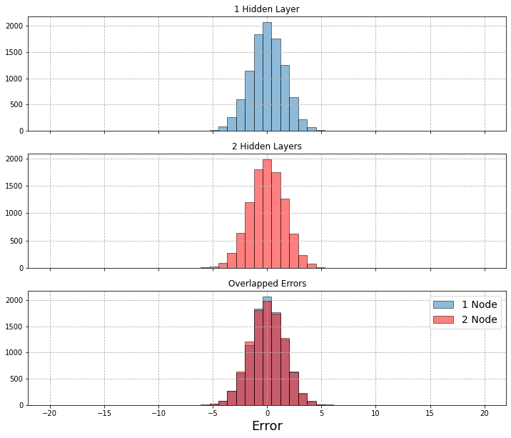

# Imports


```python
''' For Machine Learning ''' 
from keras.layers import Input, Dense,Flatten
from keras.models import Model, Sequential
from keras.datasets import mnist

''' For Data Manipulation '''
import numpy as np
from sklearn.model_selection import train_test_split

''' For Visualization '''
import matplotlib.pyplot as plt

''' Other '''
import itertools
from tqdm.notebook import tnrange 
```

# Crude Model with Uncorrelated Data


```python
data = np.random.rand(1000000, 32) # Generate 1,000,000 random data points with 50 features each
train, test = train_test_split(data, test_size = 0.1, random_state = 42) # split training and testing data 
```


```python
input_dim = len(data[0]) # input dimension is equal to the number of features
hidden_layer_nodes = 2 # the number of nodes to use in the hidden layer

''' Create the Autoencoder '''
input_layer = Input(shape=(input_dim,))
encoder_layer = Dense(hidden_layer_nodes, activation='sigmoid')(input_layer)
decoder_layer = Dense(input_dim, activation='sigmoid')(encoder_layer)
autoencoder = Model(input_layer, decoder_layer)

''' Create the Encoder '''
encoder = Model(input_layer, encoder_layer)

''' Create the Decoder '''
encoded_input = Input(shape=(hidden_layer_nodes,))
decoder_layer = autoencoder.layers[-1]
decoder = Model(encoded_input, decoder_layer(encoded_input))
```


```python
autoencoder.compile(optimizer='adam', loss = 'binary_crossentropy') # compile the model
```


```python
autoencoder.fit(train,
                train,
                epochs=10, # run through the training data 10 times
                batch_size=100, # use batches of 100 before making changes
                shuffle=True, # shuffle the training data to prevent biasing
                validation_data=(test, test), # use our test data set as validation
                verbose = 0) # hide the output while training
```


    <keras.callbacks.History at 0x7fb476b5a340>


```python
encoded_test = encoder.predict(test) # encode our features
decoded_test = decoder.predict(encoded_test) # decode our encoded features

print(test[0]) # look at the actual test value
print(decoded_test[0]) # look at the reconstructed test value
```

    [0.556486   0.58612267 0.43598429 0.68282666 0.42345375 0.97432931
     0.49944351 0.10358606 0.2795492  0.33025213 0.65473529 0.93899687
     0.99052735 0.83792705 0.83594489 0.20536917 0.10406014 0.8230105
     0.86663848 0.68582927 0.25397477 0.84576008 0.82777497 0.27917432
     0.06123279 0.37242095 0.99979739 0.12593275 0.47674639 0.25945843
     0.31310348 0.7138106 ]
    [0.53921926 0.4994602  0.49328583 0.49671558 0.5022028  0.5054807
     0.4923939  0.50397915 0.5014668  0.5021777  0.4975547  0.5055389
     0.49808562 0.5042102  0.49124807 0.49604833 0.4979566  0.5032116
     0.5059231  0.49701744 0.50652647 0.5090825  0.49114063 0.5111462
     0.50072366 0.5080269  0.49587056 0.49579388 0.5297682  0.22143435
     0.5013049  0.5169519 ]


```python
error = np.sum(abs(test - decoded_test), axis = 1) # compute the absolute error across each feature 
```


```python
fig, ax = plt.subplots(figsize = (15,8))
bins = np.linspace(min(error), max(error), 100)
ax.hist(error, bins = bins, align = 'mid', edgecolor = 'black')
ax.set_title('Simple Autoencoder Results', fontsize = 24)
ax.set_xlabel('Error', fontsize = 20)
ax.set_ylabel('Number of Counts', fontsize = 20)
ax.grid(linestyle = '--')
plt.show()
```


    

    


# More Complex Model with Uncorrelated Data


```python
input_dim = len(data[0]) # input dimension is equal to the number of features
hidden_layer1_nodes = 16 # the number of nodes to use in the 1st hidden layer
hidden_layer2_nodes = 8 # the number of nodes to use in the 2nd hidden layer
hidden_layer3_nodes = 4 # the number of nodes to use in the 3rd hidden layer
hidden_layer4_nodes = 2 # the number of nodes to use in the 3rd hidden layer


''' Create the Autoencoder '''
input_layer = Input(shape=(input_dim,))
encoder_layer1 = Dense(hidden_layer1_nodes, activation='sigmoid')(input_layer)
encoder_layer2 = Dense(hidden_layer2_nodes, activation='sigmoid')(encoder_layer1)
encoder_layer3 = Dense(hidden_layer3_nodes, activation='sigmoid')(encoder_layer2)
encoder_layer4 = Dense(hidden_layer4_nodes, activation='sigmoid')(encoder_layer3)

decoder_layer1 = Dense(input_dim, activation='sigmoid')(encoder_layer4)
decoder_layer2 = Dense(input_dim, activation='sigmoid')(decoder_layer1)
decoder_layer3 = Dense(input_dim, activation='sigmoid')(decoder_layer2)
decoder_layer4 = Dense(input_dim, activation='sigmoid')(decoder_layer3)

autoencoder = Model(input_layer, decoder_layer4)

''' Create the Encoder '''
encoder = Model(input_layer, encoder_layer4)

''' Create the Decoder '''
encoded_input = Input(shape=(hidden_layer4_nodes,))
decoder_layer_1 = autoencoder.layers[-4]
decoder_layer_2 = autoencoder.layers[-3]
decoder_layer_3 = autoencoder.layers[-2]
decoder_layer_4 = autoencoder.layers[-1]

decoder = Model(encoded_input, decoder_layer_4(decoder_layer_3(decoder_layer_2(decoder_layer_1(encoded_input)))))
```


```python
autoencoder.compile(optimizer='adam', loss = 'binary_crossentropy') # compile the model
```


```python
autoencoder.fit(train,
                train,
                epochs=10, # run through the training data 10 times
                batch_size=100, # use batches of 100 before making changes
                shuffle=True, # shuffle the training data to prevent biasing
                validation_data=(test, test), # use our test data set as validation
                verbose = 0) # hide the output while training
```


    <keras.callbacks.History at 0x7fb3a1b88ac0>


```python
encoded_test = encoder.predict(test) # encode our features
decoded_test = decoder.predict(encoded_test) # decode our encoded features

print(test[0]) # look at the actual test value
print(decoded_test[0]) # look at the reconstructed test value
```

    [0.556486   0.58612267 0.43598429 0.68282666 0.42345375 0.97432931
     0.49944351 0.10358606 0.2795492  0.33025213 0.65473529 0.93899687
     0.99052735 0.83792705 0.83594489 0.20536917 0.10406014 0.8230105
     0.86663848 0.68582927 0.25397477 0.84576008 0.82777497 0.27917432
     0.06123279 0.37242095 0.99979739 0.12593275 0.47674639 0.25945843
     0.31310348 0.7138106 ]
    [0.5235458  0.5256356  0.5096446  0.79323983 0.51500344 0.5038291
     0.48975173 0.5103137  0.5213022  0.48451337 0.5384443  0.504355
     0.5069203  0.4980652  0.49509197 0.532431   0.5269899  0.5134901
     0.46503198 0.5058428  0.49001136 0.49506173 0.5165646  0.49450803
     0.4629777  0.47933778 0.46951854 0.5075482  0.5309669  0.5300103
     0.2258296  0.5555568 ]


```python
error2 = np.sum(abs(test - decoded_test), axis = 1) # compute the absolute error across each feature 
```


```python
fig, ax = plt.subplots(figsize = (15,8))
bins = np.linspace(min(error2), max(error2), 100)
ax.hist(error2, bins = bins, align = 'mid', edgecolor = 'black')
ax.set_title('Complex Autoencoder Results', fontsize = 24)
ax.set_xlabel('Error', fontsize = 20)
ax.set_ylabel('Number of Counts', fontsize = 20)
ax.grid(linestyle = '--')
plt.show()
```


    

    


```python
fig, ax = plt.subplots(figsize = (15,8))
bins = np.linspace(min(error2), max(error2), 100)
ax.hist(error, bins = bins, align = 'mid', edgecolor = 'black', label = r'$\sigma = %s$' % round(np.std(error), 3), alpha = 0.75)
ax.hist(error2, bins = bins, align = 'mid', edgecolor = 'black', label = r'$\sigma = %s$' % round(np.std(error2), 3), alpha = 0.75)
ax.set_title('Comparison', fontsize = 24)
ax.set_xlabel('Error', fontsize = 20)
ax.set_ylabel('Number of Counts', fontsize = 20)
ax.grid(linestyle = '--')
ax.legend(fontsize = 18)
plt.show()
```


    

    


# Does the Number of Features Matter?


```python
def simple_autoencoder(input_dim, data):
    
    train, test = train_test_split(data, test_size = 0.1, random_state = 42) # split training and testing data 

    hidden_layer_nodes = 2 # the number of nodes to use in the hidden layer

    ''' Create the Autoencoder '''
    input_layer = Input(shape=(input_dim,))
    encoder_layer = Dense(hidden_layer_nodes, activation='sigmoid')(input_layer)
    decoder_layer = Dense(input_dim, activation='sigmoid')(encoder_layer)
    autoencoder = Model(input_layer, decoder_layer)

    ''' Create the Encoder '''
    encoder = Model(input_layer, encoder_layer)

    ''' Create the Decoder '''
    encoded_input = Input(shape=(hidden_layer_nodes,))
    decoder_layer = autoencoder.layers[-1]
    decoder = Model(encoded_input, decoder_layer(encoded_input))
    
    autoencoder.compile(optimizer='adam', loss='binary_crossentropy')
    
    autoencoder.fit(train,
                train,
                epochs=10, # run through the training data 10 times
                batch_size=100, # use batches of 100 before making changes
                shuffle=True, # shuffle the training data to prevent biasing
                validation_data=(test, test), # use our test data set as validation
                verbose = 0) # hide the output while training
    
    encoded_test = encoder.predict(test) # encode our features
    decoded_test = decoder.predict(encoded_test) # decode our encoded features
    
    error = np.sum(abs(test - decoded_test), axis = 1) # compute the absolute error across each feature 
    
    return test, encoded_test, decoded_test, error
```


```python
errors = []
for i in tnrange(1,6):
    data = np.random.rand(1000000, 2**i) # Generate 1,000,000 random data points with 50 features each
    errors.append(simple_autoencoder(2**i, data)[-1])
```


    HBox(children=(HTML(value=''), FloatProgress(value=0.0, max=5.0), HTML(value='')))


    


```python
fig, ax = plt.subplots(figsize = (15,8))
bins = np.linspace(0, np.max(errors), 200)

for i, vals in enumerate(errors):
    ax.hist(vals, bins = bins, align = 'mid', edgecolor = 'black', alpha = 0.75, label = '%s Input Features: $\sigma = %s$' % (2**(i+1), round(np.std(vals), 3)))
    
ax.set_title('Error Distributions as Functions of Input Features', fontsize = 24)
ax.set_xlabel('Error', fontsize = 20)
ax.set_ylabel('Number of Counts', fontsize = 20)
ax.grid(linestyle = '--')
ax.legend(fontsize = 18)
plt.show()
```


    

    


# What About More Correlated Data?


```python
data = []
for j in range(1000000):
    random_start = np.random.rand()*2*np.pi
    v_list = np.linspace(random_start, random_start+np.pi, 32)
    data.append(np.sin(v_list)**2)
data = np.array(data)
```


```python
errors = []
for i in tnrange(1,6):

    num_features = 2**i
    data = []
    for j in range(1000000):
        random_start = np.random.rand()*2*np.pi
        v_list = np.linspace(random_start, random_start+, num_features)
        data.append(np.sin(v_list)**2)
    data = np.array(data)
    
    errors.append(simple_autoencoder(2**i, data)[-1])
```


    HBox(children=(HTML(value=''), FloatProgress(value=0.0, max=5.0), HTML(value='')))


    


```python
fig, ax = plt.subplots(figsize = (15,8))
bins = np.linspace(0, np.max(errors), 200)

for i, vals in enumerate(errors):
    ax.hist(vals, bins = bins, align = 'mid', edgecolor = 'black', alpha = 0.75, label = '%s Input Features: $\sigma = %s$' % (2**(i+1), round(np.std(vals), 3)))
    
ax.set_title('Error Distributions as Functions of Input Features', fontsize = 24)
ax.set_xlabel('Error', fontsize = 20)
ax.set_ylabel('Number of Counts', fontsize = 20)
ax.grid(linestyle = '--')
ax.legend(fontsize = 18)
plt.show()
```


    

    


# Now Do the Number of Layers Matter?


```python
data = []
for j in range(1000000):
    random_start = np.random.rand()*2*np.pi
    v_list = np.linspace(random_start, random_start+np.pi, 32)
    data.append(np.sin(v_list)**2)
data = np.array(data)
train, test = train_test_split(data, test_size = 0.1, random_state = 42) # split training and testing data 
    
input_dim = len(data[0]) # input dimension is equal to the number of features
hidden_layer_nodes = 2 # the number of nodes to use in the hidden layer

''' Create the Autoencoder '''
input_layer = Input(shape=(input_dim,))
encoder_layer = Dense(hidden_layer_nodes, activation='sigmoid')(input_layer)
decoder_layer = Dense(input_dim, activation='sigmoid')(encoder_layer)
autoencoder = Model(input_layer, decoder_layer)

''' Create the Encoder '''
encoder = Model(input_layer, encoder_layer)

''' Create the Decoder '''
encoded_input = Input(shape=(hidden_layer_nodes,))
decoder_layer = autoencoder.layers[-1]
decoder = Model(encoded_input, decoder_layer(encoded_input))

autoencoder.compile(optimizer='adam', loss = 'binary_crossentropy') # compile the model

autoencoder.fit(train,
                train,
                epochs=10, # run through the training data 10 times
                batch_size=100, # use batches of 100 before making changes
                shuffle=True, # shuffle the training data to prevent biasing
                validation_data=(test, test), # use our test data set as validation
                verbose = 0) # hide the output while training

encoded_test = encoder.predict(test) # encode our features
decoded_test = decoder.predict(encoded_test) # decode our encoded features

error1 = np.sum(abs(test - decoded_test), axis = 1) # compute the absolute error across each feature 

###########################################################################

input_dim = len(data[0]) # input dimension is equal to the number of features
hidden_layer1_nodes = 4 # the number of nodes to use in the 3rd hidden layer
hidden_layer2_nodes = 2 # the number of nodes to use in the 3rd hidden layer


''' Create the Autoencoder '''
input_layer = Input(shape=(input_dim,))
encoder_layer1 = Dense(hidden_layer1_nodes, activation='sigmoid')(input_layer)
encoder_layer2 = Dense(hidden_layer2_nodes, activation='sigmoid')(encoder_layer1)

decoder_layer1 = Dense(input_dim, activation='sigmoid')(encoder_layer2)
decoder_layer2 = Dense(input_dim, activation='sigmoid')(decoder_layer1)


autoencoder = Model(input_layer, decoder_layer2)

''' Create the Encoder '''
encoder = Model(input_layer, encoder_layer2)

''' Create the Decoder '''
encoded_input = Input(shape=(hidden_layer2_nodes,))
decoder_layer_1 = autoencoder.layers[-2]
decoder_layer_2 = autoencoder.layers[-1]

decoder = Model(encoded_input, decoder_layer_2(decoder_layer_1(encoded_input)))

autoencoder.compile(optimizer='adam', loss = 'binary_crossentropy') # compile the model

autoencoder.fit(train,
                train,
                epochs=10, # run through the training data 10 times
                batch_size=100, # use batches of 100 before making changes
                shuffle=True, # shuffle the training data to prevent biasing
                validation_data=(test, test), # use our test data set as validation
                verbose = 0) # hide the output while training

encoded_test = encoder.predict(test) # encode our features
decoded_test = decoder.predict(encoded_test) # decode our encoded features

error2 = np.sum(abs(test - decoded_test), axis = 1) # compute the absolute error across each feature 

###########################################################################

input_dim = len(data[0]) # input dimension is equal to the number of features
hidden_layer1_nodes = 8 # the number of nodes to use in the 2nd hidden layer
hidden_layer2_nodes = 4 # the number of nodes to use in the 3rd hidden layer
hidden_layer3_nodes = 2 # the number of nodes to use in the 3rd hidden layer


''' Create the Autoencoder '''
input_layer = Input(shape=(input_dim,))
encoder_layer1 = Dense(hidden_layer1_nodes, activation='sigmoid')(input_layer)
encoder_layer2 = Dense(hidden_layer2_nodes, activation='sigmoid')(encoder_layer1)
encoder_layer3 = Dense(hidden_layer3_nodes, activation='sigmoid')(encoder_layer2)

decoder_layer1 = Dense(input_dim, activation='sigmoid')(encoder_layer3)
decoder_layer2 = Dense(input_dim, activation='sigmoid')(decoder_layer1)
decoder_layer3 = Dense(input_dim, activation='sigmoid')(decoder_layer2)

autoencoder = Model(input_layer, decoder_layer3)

''' Create the Encoder '''
encoder = Model(input_layer, encoder_layer3)

''' Create the Decoder '''
encoded_input = Input(shape=(hidden_layer3_nodes,))
decoder_layer_1 = autoencoder.layers[-3]
decoder_layer_2 = autoencoder.layers[-2]
decoder_layer_3 = autoencoder.layers[-1]

decoder = Model(encoded_input, decoder_layer_3(decoder_layer_2(decoder_layer_1(encoded_input))))

autoencoder.compile(optimizer='adam', loss = 'binary_crossentropy') # compile the model

autoencoder.fit(train,
                train,
                epochs=10, # run through the training data 10 times
                batch_size=100, # use batches of 100 before making changes
                shuffle=True, # shuffle the training data to prevent biasing
                validation_data=(test, test), # use our test data set as validation
                verbose = 0) # hide the output while training

encoded_test = encoder.predict(test) # encode our features
decoded_test = decoder.predict(encoded_test) # decode our encoded features

error3 = np.sum(abs(test - decoded_test), axis = 1) # compute the absolute error across each feature 

###########################################################################

input_dim = len(data[0]) # input dimension is equal to the number of features
hidden_layer1_nodes = 16 # the number of nodes to use in the 1st hidden layer
hidden_layer2_nodes = 8 # the number of nodes to use in the 2nd hidden layer
hidden_layer3_nodes = 4 # the number of nodes to use in the 3rd hidden layer
hidden_layer4_nodes = 2 # the number of nodes to use in the 3rd hidden layer


''' Create the Autoencoder '''
input_layer = Input(shape=(input_dim,))
encoder_layer1 = Dense(hidden_layer1_nodes, activation='sigmoid')(input_layer)
encoder_layer2 = Dense(hidden_layer2_nodes, activation='sigmoid')(encoder_layer1)
encoder_layer3 = Dense(hidden_layer3_nodes, activation='sigmoid')(encoder_layer2)
encoder_layer4 = Dense(hidden_layer4_nodes, activation='sigmoid')(encoder_layer3)

decoder_layer1 = Dense(input_dim, activation='sigmoid')(encoder_layer4)
decoder_layer2 = Dense(input_dim, activation='sigmoid')(decoder_layer1)
decoder_layer3 = Dense(input_dim, activation='sigmoid')(decoder_layer2)
decoder_layer4 = Dense(input_dim, activation='sigmoid')(decoder_layer3)

autoencoder = Model(input_layer, decoder_layer4)

''' Create the Encoder '''
encoder = Model(input_layer, encoder_layer4)

''' Create the Decoder '''
encoded_input = Input(shape=(hidden_layer4_nodes,))
decoder_layer_1 = autoencoder.layers[-4]
decoder_layer_2 = autoencoder.layers[-3]
decoder_layer_3 = autoencoder.layers[-2]
decoder_layer_4 = autoencoder.layers[-1]

decoder = Model(encoded_input, decoder_layer_4(decoder_layer_3(decoder_layer_2(decoder_layer_1(encoded_input)))))

autoencoder.compile(optimizer='adam', loss = 'binary_crossentropy') # compile the model

autoencoder.fit(train,
                train,
                epochs=10, # run through the training data 10 times
                batch_size=100, # use batches of 100 before making changes
                shuffle=True, # shuffle the training data to prevent biasing
                validation_data=(test, test), # use our test data set as validation
                verbose = 0) # hide the output while training

encoded_test = encoder.predict(test) # encode our features
decoded_test = decoder.predict(encoded_test) # decode our encoded features

error4 = np.sum(abs(test - decoded_test), axis = 1) # compute the absolute error across each feature 

fig, ax = plt.subplots(figsize = (15,8))
bins = np.linspace(0, 3, 100)

ax.hist(error1, bins = bins, align = 'mid', edgecolor = 'black', label = r'1 Layer Autoencoder: $\sigma = %s$' % round(np.std(error1), 3))
ax.hist(error2, bins = bins, align = 'mid', edgecolor = 'black', label = r'2 Layer Autoencoder: $\sigma = %s$' % round(np.std(error2), 3))
ax.hist(error3, bins = bins, align = 'mid', edgecolor = 'black', label = r'3 Layer Autoencoder: $\sigma = %s$' % round(np.std(error3), 3))
ax.hist(error4, bins = bins, align = 'mid', edgecolor = 'black', label = r'4 Layer Autoencoder: $\sigma = %s$' % round(np.std(error4), 3))

ax.set_xlabel('Error', fontsize = 20)
ax.set_ylabel('Number of Counts', fontsize = 20)
ax.grid(linestyle = '--')
ax.legend(fontsize = 18)
plt.show()
```


    

    


# The MNIST Dataset


```python
(x_train, _), (x_test, _) = mnist.load_data()
x_train = (x_train.astype('float32') / 255.).reshape(len(x_train), len(x_train[0])*len(x_train[0][0]))
x_test = (x_test.astype('float32') / 255.).reshape(len(x_test), len(x_test[0])*len(x_test[0][0]))
```


```python
input_dim = len(x_train[0]) # input dimension is equal to the number of features
hidden_layer_nodes = 32 # the number of nodes to use in the hidden layer

''' Create the Autoencoder '''
input_layer = Input(shape=(input_dim,))
encoder_layer = Dense(hidden_layer_nodes, activation='relu')(input_layer)
decoder_layer = Dense(input_dim, activation='sigmoid')(encoder_layer)
autoencoder = Model(input_layer, decoder_layer)

''' Create the Encoder '''
encoder = Model(input_layer, encoder_layer)

''' Create the Decoder '''
encoded_input = Input(shape=(hidden_layer_nodes,))
decoder_layer = autoencoder.layers[-1]
decoder = Model(encoded_input, decoder_layer(encoded_input))
```


```python
autoencoder.compile(optimizer='adam', loss='binary_crossentropy')
```


```python
autoencoder.fit(x_train, x_train,
                epochs=10,
                batch_size=256,
                shuffle=True,
                validation_data=(x_test, x_test), 
                verbose = 0)
```


    <keras.callbacks.History at 0x7fb4356e9be0>


```python
encoded_imgs = encoder.predict(x_test)
decoded_imgs = decoder.predict(encoded_imgs)
```


```python
n = 10  # how many digits we will display
plt.figure(figsize=(20, 4))
for i in range(n):
    # display original
    ax = plt.subplot(2, n, i + 1)
    plt.imshow(x_test[i].reshape(28, 28))
    plt.gray()
    ax.get_xaxis().set_visible(False)
    ax.get_yaxis().set_visible(False)
    
    # display reconstruction
    ax = plt.subplot(2, n, i + 1 + n)
    plt.imshow(decoded_imgs[i].reshape(28, 28))
    plt.gray()
    ax.get_xaxis().set_visible(False)
    ax.get_yaxis().set_visible(False)
plt.show()
```


    

    


```python
error = np.sum(abs(x_test - decoded_imgs), axis = 1) # compute the absolute error across each feature 

fig, ax = plt.subplots(figsize = (15,8))
bins = np.linspace(min(error), max(error), 100)
ax.hist(error, bins = bins, align = 'mid', edgecolor = 'black')
ax.set_title('Complex Autoencoder Results', fontsize = 20)
ax.set_xlabel('Error', fontsize = 18)
ax.set_ylabel('Number of Counts', fontsize = 18)
ax.grid(linestyle = '--')
plt.show()
```


```python
Dict = {} # create dictionary to map each index to its error value 
for i in range(len(error)): 
    Dict[i] = error[i]
```


```python
worst = list(dict(sorted(Dict.items(), key=lambda item: item[1], reverse = True))) # pick out the worst 10 reconstructions

plt.figure(figsize=(20, 4))
for i in range(10):
    ax = plt.subplot(2, 10, i + 1)
    plt.imshow(x_test[worst[i]].reshape(28, 28)) # display the original
    plt.gray()
    ax.get_xaxis().set_visible(False)
    ax.get_yaxis().set_visible(False)
    
    ax = plt.subplot(2, 10, i + 11)
    plt.imshow(decoded_imgs[worst[i]].reshape(28, 28)) # display reconstruction
    plt.gray()
    ax.get_xaxis().set_visible(False)
    ax.get_yaxis().set_visible(False)
    
plt.show()    
```


    

    


```python
best = list(dict(sorted(Dict.items(), key=lambda item: item[1]))) # pick out the best 10 reconstructions

plt.figure(figsize=(20, 4))
for i in range(10):
    ax = plt.subplot(2, 10, i + 1)
    plt.imshow(x_test[best[i]].reshape(28, 28)) # display the original
    plt.gray()
    ax.get_xaxis().set_visible(False)
    ax.get_yaxis().set_visible(False)
    
    ax = plt.subplot(2, 10, i + 11)
    plt.imshow(decoded_imgs[best[i]].reshape(28, 28)) # display reconstruction
    plt.gray()
    ax.get_xaxis().set_visible(False)
    ax.get_yaxis().set_visible(False)
    
plt.show()    
```


    

    


# Plot Used for Website Post


```python
fig, ax = plt.subplots(2, 2, figsize = (10,10), constrained_layout = True)

ax[0][0].imshow(x_test[0].reshape(28,28))
ax[0][0].get_xaxis().set_visible(False)
ax[0][0].get_yaxis().set_visible(False)

ax[1][0].imshow(decoded_imgs[0].reshape(28,28))
ax[1][0].get_xaxis().set_visible(False)
ax[1][0].get_yaxis().set_visible(False)

ax[0][1].imshow(x_test[1].reshape(28,28))
ax[0][1].get_xaxis().set_visible(False)
ax[0][1].get_yaxis().set_visible(False)

ax[1][1].imshow(decoded_imgs[1].reshape(28,28))
ax[1][1].get_xaxis().set_visible(False)
ax[1][1].get_yaxis().set_visible(False)

plt.savefig("Autoencoder")
```


    

    


```python

```


```python

```


```python

```


```python

```


```python

```


```python

```


```python

```
